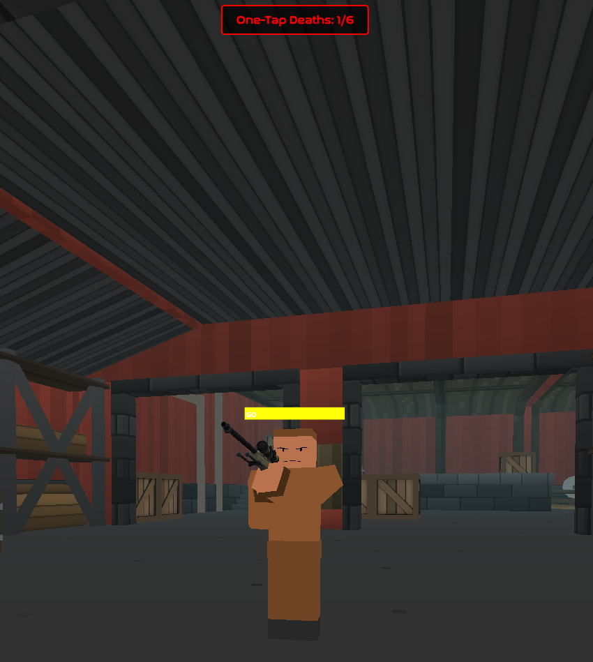

Yes its a chatGPT readme.

# Krunker One-Tap Death Counter

A lightweight userscript that tracks how many times you die to one-tap weapons in **Krunker.io**.

---

## 📦 Available Scripts

### **1. `onetap_hating.js` (Basic Version)**
- **Stats reset** when changing lobbies.
- **No data persistence** (counts only for the current lobby, e.g., `FRA:xxx` and not `FRA:xyz`).
- **Best for:** Quick testing or if you don't need saved stats.

### **2. `onetap_hating_persistent.js` (Persistent Version)**
- **Saves all data** in `localStorage` (no reset on lobby change, e.g., 5 deaths in `FRA:xxx` = 5 deaths in `FRA:xyz`).
- **Tracks stats across multiple lobbies**.
- **Best for:** Long-term tracking of one-tap deaths.

---

## 🎯 What does it do?

Ever wonder how often you get "skill-checked" by snipers? This script counts:
- **Total deaths** during your session
- **One-tap deaths** (Sniper, Crossbow, Infiltrator, thrown knives)
- Displays a live counter at the top of your screen

Perfect for tracking how often you die to one-tap weapons in a tracking-focused game!

---

## 📊 Tracked One-Tap Weapons

- **Sniper Rifle**
- **Crossbow**
- **Infiltrator**
- **Thrown Knives**

---

## ✨ Features

- Real-time death tracking via chat analysis
- Clean, non-intrusive HUD counter
- Lightweight with zero performance impact
- Automatically resets each session

---

## 🚀 Installation

1. Copy the script to your userscripts folder
2. Reload your Krunker client
3. Join a game and start playing

The counter appears automatically at the top-center of your screen.

---

## 🎮 How to Use

Just play normally! The script works automatically:

1. Every time you die, it analyzes the kill feed
2. Detects if the weapon was a one-tap
3. Updates the counter: **One-Tap Deaths: X/Y**
   - **X** = Deaths to one-tap weapons
   - **Y** = Total deaths

---

## 📸 Preview



The counter appears as a clean overlay at the top-center of your screen, showing your one-tap death ratio in real-time.

---

## 💡 How It Works

**Chat Feed Analysis:**
- Monitors the in-game chat for death messages
- Parses HTML structure to identify:
  - Your name (victim)
  - Enemy name (killer)
  - Weapon icon used
- Checks if weapon matches one-tap list
- Increments appropriate counter

---

## 📝 Technical Details

- Uses `MutationObserver` to monitor chat updates
- Analyzes kill feed HTML structure in real-time
- Identifies weapons via icon filenames (`icon_1.png`, etc.)
- Detects thrown knives by checking for both `thrownIcon` + `meleeIcon`
- Counters reset on page reload (new lobby)

---

## 🔧 Customization

Want to track different weapons? Edit the `onetapWeapons` array:

```javascript
const onetapWeapons = ['icon_1.png', 'icon_14.png', 'icon_29.png']; // Add icon filenames for other weapons
```

Change counter position by modifying the CSS in `updateCounters()`.

---

## 🤝 Contributing

- Report bugs or false positives
- Fork and customize for your needs
- Discord: Lombre_Blanche.br

---

**Stay mobile, stay alive!** 🎯
